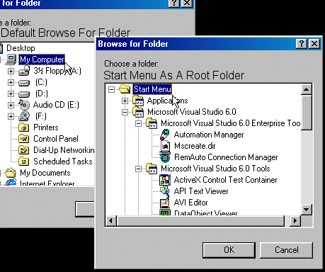



## Browse For Folder v2\.0

### Description

This is a new version for my browse for folder function, this time i have added the special folders at startup parameter, this means that you can specify a special folder that the browseforfolder start browsing from (start menu, desktop, users, common ,shared... more and more (lots of more))

the browse for folder will only start from those folders if the specified exists, also more comments added, much easyer to understand, even for beginners.
 
### More Info
 

             |
---                |---
**Submitted On**   |2000-06-27 00:00:50
**By**             |[Max Raskin](https://github.com/Planet-Source-Code/PSCIndex/blob/master/ByAuthor/max-raskin.md)
**Level**          |Intermediate
**User Rating**    |4.9 (34 globes from 7 users)
**Compatibility**  |VB 3\.0, VB 4\.0 \(16\-bit\), VB 4\.0 \(32\-bit\), VB 5\.0, VB 6\.0, VB Script, ASP \(Active Server Pages\) 
**Category**       |[Windows API Call/ Explanation](https://github.com/Planet-Source-Code/PSCIndex/blob/master/ByCategory/windows-api-call-explanation__1-39.md)
**World**          |[Visual Basic](https://github.com/Planet-Source-Code/PSCIndex/blob/master/ByWorld/visual-basic.md)
**Archive File**   |[CODE\_UPLOAD71846262000\.zip](https://github.com/Planet-Source-Code/max-raskin-browse-for-folder-v2-0__1-9290/archive/master.zip)

